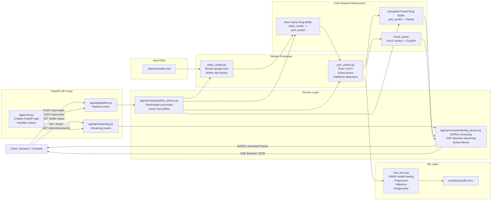

```mermaid
flowchart LR
    Client["Client / Browser / Frontend"]

    subgraph API["FastAPI API Layer"]
        Main["app/main.py<br/>Creates FastAPI app<br/>Includes routers"]
        PipelineAPI["app/api/pipeline.py<br/>Pipeline routes"]
        StreamingAPI["app/api/streaming.py<br/>Streaming routes"]
    end

    subgraph Services["Service Layer"]
        PipelineService["app/services/pipeline_service.py<br/>Starts/stops processes<br/>Owns ring buffers"]
        StreamingService["app/services/streaming_service.py<br/>MJPEG streaming<br/>SSE detection streaming<br/>Queue fanout"]
    end

    subgraph Workers["Worker Processes"]
        VideoReader["video_reader.py<br/>Reads sample.mp4<br/>Writes raw frames"]
        YOLOWorker["yolo_worker.py<br/>Runs YOLO<br/>Draws boxes<br/>Publishes detections"]
    end

    subgraph Core["Core Shared Infrastructure"]
        RawRing["Raw Frame Ring Buffer<br/>video_reader -> yolo_worker"]
        AnnotatedRing["Annotated Frame Ring Buffer<br/>yolo_worker -> /frame"]
        DetectionQueue["result_queue<br/>YOLO worker -> FastAPI"]
    end

    subgraph ML["ML Layer"]
        YOLOONNX["yolo_onnx.py<br/>ONNX model loading<br/>Preprocess<br/>Inference<br/>Postprocess"]
        Model["models/yolov8n.onnx"]
    end

    subgraph Data["Input Data"]
        Video["videos/sample.mp4"]
    end

    Client -->|"POST /start-video<br/>POST /stop-video<br/>GET /buffer-status"| PipelineAPI
    Client -->|"GET /frame<br/>GET /detections/events"| StreamingAPI

    Main --> PipelineAPI
    Main --> StreamingAPI

    PipelineAPI --> PipelineService
    StreamingAPI --> StreamingService

    PipelineService --> VideoReader
    PipelineService --> YOLOWorker
    PipelineService --> RawRing
    PipelineService --> AnnotatedRing

    Video --> VideoReader
    VideoReader --> RawRing
    RawRing --> YOLOWorker

    YOLOWorker --> YOLOONNX
    YOLOONNX --> Model
    YOLOWorker --> AnnotatedRing
    YOLOWorker --> DetectionQueue

    AnnotatedRing --> StreamingService
    DetectionQueue --> StreamingService

    StreamingService -->|"MJPEG annotated frames"| Client
    StreamingService -->|"SSE detection JSON"| Client
```