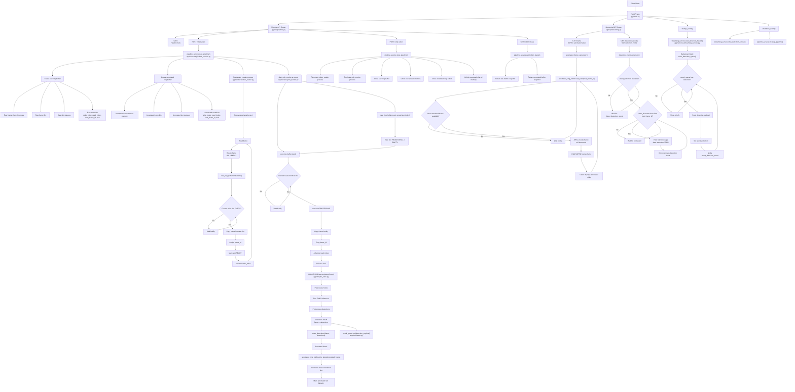

```mermaid
flowchart TD
    A["Client / User"] --> B["FastAPI app<br/>app/main.py"]

    B --> C["Pipeline API Router<br/>app/api/pipeline.py"]
    B --> D["Streaming API Router<br/>app/api/streaming.py"]

    C --> C1["GET /<br/>Health check"]
    C --> C2["POST /start-video"]
    C --> C3["POST /stop-video"]
    C --> C4["GET /buffer-status"]

    D --> D1["GET /frame<br/>MJPEG annotated video"]
    D --> D2["GET /detections/events<br/>SSE detection JSON"]

    C2 --> E["pipeline_service.start_pipeline()<br/>app/services/pipeline_service.py"]

    E --> F["Create raw RingBuffer"]
    E --> G["Create annotated RingBuffer"]

    F --> F1["Raw frame shared memory"]
    F --> F2["Raw frame IDs"]
    F --> F3["Raw slot statuses"]
    F --> F4["Raw metadata<br/>write_index, read_index, next_frame_id, lock"]

    G --> G1["Annotated frame shared memory"]
    G --> G2["Annotated frame IDs"]
    G --> G3["Annotated slot statuses"]
    G --> G4["Annotated metadata<br/>write_index, read_index, next_frame_id, lock"]

    E --> H["Start video_reader process<br/>app/workers/video_reader.py"]
    E --> I["Start yolo_worker process<br/>app/workers/yolo_worker.py"]

    H --> J["Open videos/sample.mp4"]
    J --> K["Read frame"]
    K --> L["Resize frame<br/>480 x 640 x 3"]
    L --> M["raw_ring_buffer.write(frame)"]

    M --> N{"Current write slot EMPTY?"}
    N -- "No" --> O["Wait briefly"]
    O --> N
    N -- "Yes" --> P["Copy frame into raw slot"]
    P --> Q["Assign frame_id"]
    Q --> R["Mark slot READY"]
    R --> S["Advance write_index"]
    S --> K

    I --> T["raw_ring_buffer.read()"]
    T --> U{"Current read slot READY?"}
    U -- "No" --> V["Wait briefly"]
    V --> U
    U -- "Yes" --> W["Mark slot PROCESSING"]
    W --> X["Copy frame locally"]
    X --> Y["Copy frame_id"]
    Y --> Z["Advance read_index"]
    Z --> AA["Release lock"]

    AA --> AB["YOLOONNXDetector.detect(frame)<br/>app/ml/yolo_onnx.py"]
    AB --> AC["Preprocess frame"]
    AC --> AD["Run ONNX inference"]
    AD --> AE["Postprocess detections"]
    AE --> AF["Detection JSON<br/>frame + detections"]

    AF --> AG["draw_detections(frame, detections)"]
    AG --> AH["Annotated frame"]

    AH --> AI["annotated_ring_buffer.write_latest(annotated_frame)"]
    AI --> AJ["Overwrite latest annotated slot"]
    AJ --> AK["Mark annotated slot READY"]

    AF --> AL["result_queue.put(detection_payload)<br/>app/core/state.py"]

    I --> AM["raw_ring_buffer.mark_empty(slot_index)"]
    AM --> AN["Raw slot PROCESSING -> EMPTY"]
    AN --> T

    B --> AO["startup_event()"]
    AO --> AP["streaming_service.start_detection_fanout()<br/>app/services/streaming_service.py"]
    AP --> AQ["Background task:<br/>drain_detection_queue()"]

    AQ --> AR{"result_queue has detection?"}
    AR -- "No" --> AS["Sleep briefly"]
    AS --> AR
    AR -- "Yes" --> AT["Read detection payload"]
    AT --> AU["Set latest_detection"]
    AU --> AV["Notify latest_detection_event"]
    AV --> AR

    D2 --> AW["detection_event_generator()"]
    AW --> AX{"latest_detection available?"}
    AX -- "No" --> AY["Wait for latest_detection_event"]
    AY --> AX
    AX -- "Yes" --> AZ{"frame_id newer than client last_frame_id?"}
    AZ -- "No" --> BA["Wait for next event"]
    BA --> AZ
    AZ -- "Yes" --> BB["Yield SSE message<br/>data: detection JSON"]
    BB --> BC["Client receives detection event"]
    BC --> AZ

    D1 --> BD["annotated_frame_generator()"]
    BD --> BE["annotated_ring_buffer.read_latest(last_frame_id)"]
    BE --> BF{"New annotated frame available?"}
    BF -- "No" --> BG["Wait briefly"]
    BG --> BE
    BF -- "Yes" --> BH["JPEG encode frame<br/>cv2.imencode"]
    BH --> BI["Yield MJPEG frame chunk"]
    BI --> BJ["Client displays annotated video"]
    BJ --> BE

    C4 --> BK["pipeline_service.get_buffer_status()"]
    BK --> BL["Return raw buffer snapshot"]
    BK --> BM["Return annotated buffer snapshot"]

    C3 --> BN["pipeline_service.stop_pipeline()"]
    BN --> BO["Terminate video_reader process"]
    BN --> BP["Terminate yolo_worker process"]
    BN --> BQ["Close raw ring buffer"]
    BN --> BR["Unlink raw shared memory"]
    BN --> BS["Close annotated ring buffer"]
    BN --> BT["Unlink annotated shared memory"]

    B --> BU["shutdown_event()"]
    BU --> BV["streaming_service.stop_detection_fanout()"]
    BU --> BW["pipeline_service.cleanup_pipeline()"]
```